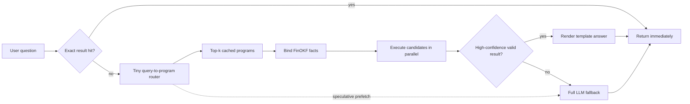

# FlashOKF: Speculative Query Compilation for Near-Instant Equity Research

## The idea in one paragraph

Most caching systems still send every question through a large language model. They save time by reusing document embeddings, prompt prefixes, or KV caches, but the expensive model remains in the request path.

**FlashOKF takes a more aggressive approach: for common structured equity questions, do not call the large model at all.** It learns that questions such as “What was Apple's 2025 revenue growth?” and “How fast did Microsoft sales grow last year?” share the same executable program. The program is cached once, bound to the requested company's FinOKF facts, executed directly, and rendered into an answer. The result can arrive in milliseconds. Questions that cannot be compiled safely fall back to the full LLM pipeline, where document and KV caching still reduce latency.

The paper's central question is:

> How much LLM inference can be replaced by cached, executable programs over structured knowledge without reducing answer quality?

## Why this can beat ordinary RAG caching

Consider this question:

```text
What was Apple's gross margin in FY2025?
```

A normal RAG system performs roughly this work:

1. embed the question;
2. retrieve filing chunks;
3. construct a long prompt;
4. prefill the large model over that prompt;
5. let the model identify revenue and cost of revenue;
6. let the model calculate the margin;
7. generate the answer.

FlashOKF recognizes a previously learned query program:

```text
gross_margin(entity, period) =
    (revenue(entity, period) - cost_of_revenue(entity, period))
    / revenue(entity, period)
```

It then reads the two required facts from an indexed FinOKF store, runs the arithmetic, and fills an answer template:

```text
Apple's FY2025 gross margin was 46.2%.
```

The large model never starts. Avoiding an operation entirely is a larger latency opportunity than making that operation somewhat faster.

## Core insight: cache computations, not just text

Equity-research questions repeat at three levels:

1. **Exact repeats:** the same question is asked again.
2. **Parameterized repeats:** the same analysis is requested for another company or year.
3. **Partially shared analyses:** different questions reuse part of the same calculation or evidence.

Examples:

```text
What was AAPL's FY2025 gross margin?
What was MSFT's FY2025 gross margin?
Compare AAPL and MSFT gross margins in FY2025.
How did AAPL gross margin change from FY2024 to FY2025?
```

These are not exact text-cache hits. They do, however, reuse the same small set of programs and fact roles.

FlashOKF stores five objects:

| Cache | Stores | Typical reuse |
| --- | --- | --- |
| Result cache | Final answer plus exact input hashes | Identical question and unchanged facts |
| Program cache | Parameterized executable analysis | Same analysis across companies and years |
| Evidence cache | Bound FinOKF fact subgraphs | Related questions over the same company and period |
| Render cache | Tokenized canonical evidence prompt | LLM fallback questions sharing evidence |
| KV cache | Model-specific attention state | Warm LLM fallback requests |

The result and program caches are the novel fast path. The evidence, render, and KV caches make misses cheaper.

## Request flow



The system starts several cheap operations in parallel:

- exact-result lookup;
- query-to-program prediction;
- entity and period extraction;
- retrieval of likely FinOKF fact blocks;
- prefetch of likely prompt/KV blocks for the fallback.

If the compiled fast path succeeds, the fallback is cancelled. If it fails, much of the fallback evidence is already loaded.

This is similar to branch prediction in a processor: predict the likely work, execute it early, and fall back without waiting if the prediction is wrong.

## Clearbox cache vaults

Every chat is also a local, inspectable vault. Selecting a chat selects its vault; selecting a vault restores the same transcript and cache graph. Nothing important is hidden in an opaque database.

```text
data/vaults/answers/<chat-vault>/
  chat.md                         # complete multi-turn transcript
  turns/turn-001.md               # question, answer, and clearbox links
  cache/turn-001-program.md       # compiled operation and expression
  cache/turn-001-bindings.md      # exact fact ids, periods, hashes, sources
  cache/turn-001-metrics.md       # routing, binding, model, token, disk timing
  facts/turn-001-*.md              # readable snapshots of facts actually used
  graph.json                      # chat -> run -> bound-fact graph
  index.json                      # UI and persistence state
```

The preprocessing layer writes one compact binding file per company:

```text
data/processed/_index/flashokf/AAPL.json
data/processed/_index/flashokf/MSFT.json
data/processed/_index/flashokf-manifest.json
```

The server therefore loads only the active ticker's common financial roles rather than the complete S&P 100 corpus. Each binding points back to the authoritative Markdown fact and includes its content hash, so a result remains fast, visible, and invalidatable.

## What is learned

FlashOKF uses a small model, not the main LLM, to compile a question into a typed query plan.

Input:

```text
How quickly did Apple sales grow in fiscal 2025?
```

Predicted plan:

```yaml
program: growth_rate
slots:
  entity: AAPL
  metric: revenue
  current_period: FY2025
  prior_period: FY2024
constraints:
  same_entity: true
  same_unit: true
  comparable_duration: true
```

Executable program:

```text
growth_rate(current, prior) = (current - prior) / prior
```

The router should be trained on four kinds of pairs:

- paraphrases with the same program;
- the same program across different companies and periods;
- hard negatives with similar wording but different programs;
- questions that are not supported by any fast-path program.

Hard negatives matter most:

```text
Revenue growth in FY2025       -> growth_rate(revenue)
Earnings growth in FY2025      -> growth_rate(net_income)
Revenue as a share of assets   -> divide(revenue, assets)
```

A generic semantic cache can confuse these questions. A typed compiler must keep them separate.

## Latency-aware routing

The router is not trained only for classification accuracy. It is trained to minimize total serving latency under an accuracy constraint.

For request `q`, the decision is one of:

```text
return exact cached result
execute cached program
run small-model answer path
run full LLM fallback
```

The objective can be written as:

```text
minimize    expected end-to-end latency
subject to  answer accuracy >= full-LLM accuracy - epsilon
            fast-path error rate <= delta
```

This creates a risk-coverage-latency curve:

- a high threshold sends fewer questions to the fast path but makes fewer mistakes;
- a lower threshold increases coverage and speed but risks wrong plan selection;
- the optimal operating point depends on the application's latency and error budget.

The paper should study calibrated selective routing rather than selecting one arbitrary confidence threshold.

## Speculative execution

Waiting for the router before starting retrieval creates serial latency. FlashOKF instead uses top-k speculative execution.

Suppose the router predicts:

```yaml
candidates:
  - program: gross_margin
    probability: 0.72
  - program: operating_margin
    probability: 0.19
  - program: net_margin
    probability: 0.06
```

All three programs are tiny, so the system can bind and execute them in parallel while the final routing decision is being calibrated. This spends a small amount of CPU work to remove a much larger amount of GPU waiting.

At the same time, the fallback prefetcher loads the shared revenue, gross-profit, operating-income, and net-income fact blocks. Even a route miss is therefore useful speculation.

### Learned hedge timing

Starting the large LLM immediately minimizes miss latency but wastes GPU work on fast-path hits. Waiting too long saves GPU work but makes misses slow.

FlashOKF learns a hedge delay `tau(q)`:

```text
if fast path has not completed by tau(q):
    start the full LLM fallback
```

Easy, high-confidence questions receive a longer delay because the compiled result is likely to finish first. Ambiguous questions start the fallback almost immediately. The scheduler learns `tau(q)` from observed router confidence, program count, evidence-cache state, queue depth, and recent service times.

This learned hedging policy is a strong ML contribution because it directly optimizes tail latency under variable system load.

## Cache keys and invalidation

An instant but stale answer is not a successful cache hit. Every result is tied to the exact FinOKF facts used to compute it.

```yaml
result_cache_key:
  program_hash: sha256:program...
  bindings:
    entity: AAPL
    period: FY2025
  fact_hashes:
    revenue: sha256:fact1...
    cost_of_revenue: sha256:fact2...
  renderer_version: answer-template-v3
```

A new 10-Q, 10-K, amendment, or restatement changes the relevant fact hash. Old results stop matching automatically. Program templates remain reusable because the formula has not changed.

KV keys additionally include:

```yaml
kv_cache_key:
  evidence_hash: sha256:evidence...
  prompt_template_hash: sha256:prompt...
  tokenizer: tokenizer-name-and-revision
  model: model-name-and-revision
  quantization: bf16
  runtime: vllm-version
```

## LLM fallback accelerator

The fallback should still be fast. FlashOKF borrows the best ideas from RAG caching systems:

1. Canonically order FinOKF fact blocks so similar questions share longer prefixes.
2. Cache tokenized evidence blocks.
3. Cache model KV states in GPU, host memory, and optionally NVMe.
4. Prefetch predicted evidence while the router is running.
5. Use cache-aware batching and request scheduling.

The first implementation can use exact prefix caching through vLLM or SGLang. A later implementation can integrate modular KV fusion such as CacheBlend, ProphetKV, or editable/composable KV methods.

The research contribution is not another small change to KV eviction. It is the **latency-optimal cascade that avoids LLM inference when structured execution is sufficient and hides fast-path misses with speculative fallback work**.

## Why this is different from current work

| Method | Main optimization | Large LLM still required? |
| --- | --- | --- |
| [RAGCache](https://arxiv.org/abs/2404.12457) | Reuses ordered-document KV prefixes across requests | Yes |
| [CacheBlend](https://arxiv.org/abs/2405.16444) | Fuses cached chunks with selective token recomputation | Yes |
| [SubGCache](https://arxiv.org/abs/2505.10951) | Reuses representative subgraph KV caches | Yes |
| [CacheClip](https://arxiv.org/abs/2510.10129) | Uses a small model to select tokens for KV recomputation | Yes |
| [ProphetKV](https://arxiv.org/abs/2602.02579) | Uses query-driven selective KV recomputation | Yes |
| [Models Take Notes at Prefill](https://arxiv.org/abs/2606.17107) | Edits and composes precompiled KV notes | Yes |
| **FlashOKF** | Reuses executable programs and returns before LLM inference; accelerates only the fallback with KV reuse | **No, on accepted fast-path queries** |

This is the positioning sentence:

> Prior work asks how to make repeated LLM prefill faster. FlashOKF asks when repeated LLM prefill can be removed from the critical path altogether.

## Example program library

The first release should support a deliberately small but high-frequency program set.

```yaml
programs:
  direct_fact:
    examples: [revenue, net_income, assets, debt, eps]

  growth_rate:
    formula: (current - prior) / prior
    examples: [revenue_growth, earnings_growth, asset_growth]

  margin:
    formula: profit / revenue
    examples: [gross_margin, operating_margin, net_margin]

  per_share:
    formula: amount / diluted_shares
    examples: [free_cash_flow_per_share]

  leverage:
    formula: debt / equity
    examples: [debt_to_equity]

  compare:
    formula: metric_a - metric_b
    examples: [company_comparison, period_comparison]

  composition:
    formula: component / total
    examples: [segment_revenue_share, capex_as_percent_of_revenue]
```

Each program defines required fact roles, allowed units, period rules, and output formatting. The program library grows from observed uncached queries.

## Research questions

### RQ1: Fast-path coverage

What fraction of real equity-research questions can be compiled into a small typed program?

If coverage is low, the idea cannot materially improve overall latency.

### RQ2: End-to-end latency

How much does speculative program execution reduce p50, p95, and p99 latency compared with the strongest response, semantic, prefix, and RAG KV-cache baselines?

### RQ3: Miss penalty

Can evidence/KV prefetch and learned hedge timing make a failed fast-path attempt nearly free?

### RQ4: Load adaptation

Does the learned router and hedge policy outperform fixed confidence thresholds and fixed fallback delays as GPU queue depth and request mix change?

### RQ5: Generalization

Can the query compiler reuse a program for unseen companies, fiscal periods, and paraphrases?

## FlashOKFBench

The paper needs a workload benchmark designed around latency and reuse.

Each record should contain:

```yaml
question: "How fast did Apple's revenue grow in FY2025?"
gold_program: growth_rate
gold_slots:
  entity: AAPL
  metric: revenue
  current_period: FY2025
  prior_period: FY2024
gold_fact_ids:
  - fact:AAPL:revenue:FY2025
  - fact:AAPL:revenue:FY2024
gold_answer: "..."
query_family: revenue_growth
paraphrase_cluster: rg_001
arrival_time_ms: 18320
```

The benchmark should include:

- exact repeat queries;
- paraphrases;
- the same program across different companies;
- multi-period and multi-company questions;
- hard-negative near matches;
- qualitative questions that must use the fallback;
- cache-cold, cache-warm, and mixed traces;
- different request skews, including uniform and Zipf distributions;
- bursty loads and quiet periods;
- new-filing and amendment events.

Use company-held-out, time-held-out, and program-paraphrase-held-out test splits. Synthetic request traces are useful for controlled systems experiments, but at least one trace should come from human-authored or real analyst-style questions.

## Baselines

1. Full pipeline with no cache.
2. Exact answer cache.
3. Embedding-based semantic answer cache.
4. vLLM or SGLang exact prefix cache.
5. RAGCache-style ordered-document cache.
6. A reproducible modular KV method such as CacheBlend or ProphetKV.
7. Program cache without speculation.
8. Program cache with fixed hedge delay.
9. Full FlashOKF with learned routing, speculation, and hedging.

Every baseline must receive the same question and data snapshot. Report both accepted fast-path questions and the full mixed workload.

## Primary metrics

Latency is the headline outcome:

- p50, p95, and p99 time to first byte;
- p50, p95, and p99 time to complete answer;
- percentage of requests below a declared latency SLO;
- fast-path latency and fallback latency separately;
- miss penalty relative to a pipeline that never attempts the fast path;
- queries per second at fixed hardware and SLO;
- GPU-seconds consumed per request.

Supporting metrics are needed to keep the latency result meaningful:

- fast-path coverage;
- plan-selection accuracy;
- numeric-answer accuracy;
- exact-result, program, evidence, and KV hit rates;
- speculative work cancelled;
- stale-result rate after updates.

Do not lead with “up to” speedups. Report full latency distributions and confidence intervals.

## Ablations

- Remove exact-result caching.
- Remove program caching.
- Replace the learned router with cosine similarity.
- Use top-1 instead of top-k speculative programs.
- Disable evidence prefetch.
- Disable KV prefetch.
- Start the fallback immediately.
- Use fixed hedge delays instead of learned `tau(q)`.
- Disable queue-depth features in the hedging policy.
- Run with a cold cache only.
- Vary program-library size.
- Vary model size, prompt length, cache capacity, concurrency, and request skew.

The decisive experiment is the full-workload p95 latency comparison against the strongest KV-cache baseline. A large speedup on fast-path questions alone is not enough if qualitative misses dominate the real workload.

## Success criteria and kill gates

These are proposed targets, not claimed results.

### Gate 1: enough executable questions

At least 40-50% of the target workload should be answerable by the initial program library. Otherwise, overall latency improvement will be limited.

### Gate 2: genuinely fast execution

Accepted fast-path queries should be at least 10x faster than the full local LLM path and comfortably below 100 ms on commodity server hardware.

### Gate 3: small miss penalty

On questions that fall back, the p95 latency increase caused by attempting the fast path should remain below 5%. Prefetch should ideally make misses faster than the ordinary pipeline.

### Gate 4: overall workload win

Target at least a 2x reduction in median end-to-end latency and a 25-40% reduction in p95 latency against the strongest reproducible caching baseline, at comparable answer accuracy.

### Gate 5: load-aware policy matters

The learned hedge policy should improve p95 latency or SLO attainment over the best fixed-delay policy across changing request loads. If it does not, use the simpler fixed policy and narrow the paper.

## What makes this NeurIPS/ICML-grade rather than a cache demo

The paper needs four contributions together:

1. **A new serving formulation:** selective replacement of LLM inference with cached executable programs over structured knowledge.
2. **A learning problem:** latency-aware query compilation and hedged routing under an accuracy constraint.
3. **A systems implementation:** parallel fast path, fallback prefetch, cancellation, and multilevel caches integrated with a real serving engine.
4. **A public benchmark:** query families, cache traces, hard negatives, and workload shifts.

For stronger generality, evaluate the same method on a second structured domain such as scientific tables, sports statistics, or database QA. FinOKF remains the primary testbed, but the algorithm should be described as structured-RAG acceleration rather than a one-off finance rule engine.

## Suggested project structure

```text
FinOKF/
  flashokf/
    router/
      encoder.py              # question representation
      compiler.py             # question -> program and slots
      calibrate.py            # confidence and abstention
      train.py

    programs/
      schema.py               # typed program representation
      registry.py             # growth, margin, compare, composition
      executor.py             # vectorized exact execution
      templates.py            # low-latency answer rendering

    index/
      facts.py                # tag/fact-role inverted index
      entities.py
      periods.py
      build.py

    cache/
      results.py
      programs.py
      evidence.py
      token_blocks.py
      kv.py
      invalidation.py

    speculative/
      fanout.py               # execute top-k plans
      prefetch.py             # evidence and KV prefetch
      hedger.py               # learned fallback start time
      cancellation.py

    fallback/
      retrieval.py
      prompt.py
      llm_engine.py           # vLLM/SGLang integration

    serving/
      api.py
      scheduler.py
      metrics.py

  benchmarks/flashokfbench/
    build.py
    queries.jsonl
    traces/
    splits/
    validate.py

  experiments/
    characterize_coverage.py
    benchmark_router.py
    benchmark_latency.py
    benchmark_load.py
    benchmark_updates.py
    ablations/

  data/
    processed/                # existing FinOKF facts
    flash_cache/
      results/
      programs/
      evidence/
      tokens/
      kv/
```

## Implementation plan

### Phase 1: measure the ceiling

Label a representative question sample with executable programs. Measure the fraction covered and estimate how much total latency disappears if every supported question bypasses the LLM. Stop early if the ceiling is weak.

### Phase 2: deterministic fast path

Implement ten to twenty common programs, fact-role indexing, exact result keys, answer templates, and a manual rule-based router. This establishes the maximum speed of the serving architecture before training a model.

### Phase 3: learned compiler

Train the small query-to-program model with paraphrases and hard negatives. Produce risk-coverage curves and held-out-company results.

### Phase 4: speculation and hedging

Add top-k program execution, evidence/KV prefetch, fallback cancellation, and the load-aware hedge policy.

### Phase 5: serving integration

Connect the fallback to vLLM or SGLang, add GPU/host KV tiers, and instrument every stage of the critical path.

### Phase 6: full paper evaluation

Run cold/warm, low/high-load, update, generalization, and ablation experiments. Report latency distributions for the full mixed workload.

## Main risks

### The workload may be too qualitative

If most real questions ask for narrative explanations, management interpretation, or novel synthesis, the no-LLM fast path will have limited coverage. This must be measured before major implementation.

### The router may choose the wrong program

A fast wrong answer is not useful. High-confidence routing, hard-negative training, and fallback are essential. The paper should show the entire accuracy-latency frontier.

### Extension concepts may complicate fact binding

The same economic role can use different XBRL concepts across companies. Start with audited mappings for common facts, use filing relationships and the new `information/...` tags, and abstain when role binding is ambiguous.

### Hedging can waste GPU work

Starting the fallback too early improves tail latency but consumes GPU capacity. Report both latency and GPU-seconds per request so the learned policy cannot hide waste.

### A huge result-cache hit rate can be artificial

Exact repeats are easy. The main result should remain strong when exact duplicate questions are removed and only parameterized reuse remains.

## Recommended paper claim

> FlashOKF is a latency-aware structured-RAG serving system that compiles recurring natural-language analyses into cached executable programs, speculatively binds and executes likely programs in parallel, and starts a prefetched LLM fallback only when needed. This removes large-model inference from the critical path for supported questions and reduces full-workload median and tail latency relative to response, semantic, prefix, and document-KV caching baselines.

That sentence is the hypothesis. The paper should fill in measured effect sizes only after the experiments.

## References

- [RAGCache: Efficient Knowledge Caching for Retrieval-Augmented Generation](https://arxiv.org/abs/2404.12457)
- [CacheBlend: Fast Large Language Model Serving for RAG with Cached Knowledge Fusion](https://arxiv.org/abs/2405.16444)
- [SubGCache: Accelerating Graph-based RAG with Subgraph-level KV Cache](https://arxiv.org/abs/2505.10951)
- [Graph-KV: Breaking Sequence via Injecting Structural Biases into Large Language Models](https://arxiv.org/abs/2506.07334)
- [CacheClip: Accelerating RAG with Effective KV Cache Reuse](https://arxiv.org/abs/2510.10129)
- [ProphetKV: User-Query-Driven Selective Recomputation for Efficient KV Cache Reuse in Retrieval-Augmented Generation](https://arxiv.org/abs/2602.02579)
- [Models Take Notes at Prefill: KV Cache Can Be Editable and Composable](https://arxiv.org/abs/2606.17107)
